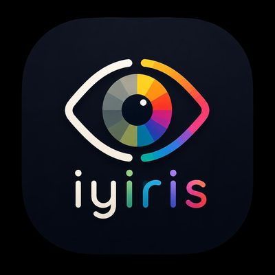

<div align="center">



<br/>

# iyiris

**Herramienta profesional de diseño de paletas de color**

*Colores para todos — sin backend, sin cuenta, sin límites*

<br/>

[](https://iyiris-mocha.vercel.app/)
[](https://github.com/JuanEstebanHerreraH/Iyiris)

<br/>


</div>

---

<div align="center">

### ¿Qué es iyiris?

</div>

**iyiris** toma un color base y genera al instante paletas armónicas, verifica accesibilidad WCAG, simula visión con daltonismo y exporta todo listo para producción. Corre completamente en el navegador — ningún dato sale de tu dispositivo.

---

## ✦ Características

<br/>

| | Función | Descripción |
|:---:|:---|:---|
| 🎨 | **Paletas automáticas** | Análogos · Complementarios · Triádicos · Monocromáticos desde un color base |
| ⚖️ | **Contraste WCAG 2.1** | Ratio en tiempo real · Niveles AA / AAA para texto normal, grande y UI |
| 👁️ | **Simulación daltonismo** | Protanopía · Deuteranopía · Tritanopía · Acromatopsia — comparativa lado a lado |
| 🖥️ | **Vista previa UI** | Paleta aplicada a navbar, cards, botones y badges en tema claro y oscuro |
| 📦 | **Exportar** | CSS custom properties · Tailwind config · JSON · Tabla HEX / RGB / HSL / CMYK |
| ⭐ | **Favoritos** | Guarda y carga paletas entre sesiones — sin servidor, solo `localStorage` |
| 📱 | **Responsive** | Diseñado para desktop y móvil |

---

## ✦ Formatos de color

```
HEX    →  #6366f1                        Web · CSS · diseño digital
RGB    →  rgb(99, 102, 241)              Pantallas · CSS moderno
HSL    →  hsl(239°, 84%, 67%)            Ajustes intuitivos · CSS moderno
CMYK   →  cmyk(59%, 58%, 0%, 5%)        🖨  Imprenta · diseño editorial
```

## ✦ Correr localmente

```bash
# 1. Clonar
git clone https://github.com/JuanEstebanHerreraH/Iyiris.git
cd Iyiris

# 2. Instalar
npm install

# 3. Desarrollo  →  http://localhost:5173
npm run dev

# 4. Build de producción
npm run build
```

---

## ✦ Stack técnico

| Capa | Tecnología | Rol |
|---|---|---|
| Framework | SvelteKit 2 + Svelte 4 | UI compilada, sin Virtual DOM |
| Lenguaje | TypeScript estricto | Tipado en toda la lógica de color |
| Estilos | Tailwind CSS 3 | Utilidades · dark mode · responsive |
| Color engine | chroma.js 2 | Armonías HSL · contraste WCAG · conversiones |
| Build | Vite 5 + adapter-static | HTML/CSS/JS puro — deploy en cualquier host |
| Desktop/Mobile | Tauri 2.0 | APK Android · .exe Windows |
| CI/CD | GitHub Actions | Compilación automática del AAB en la nube |
| Deploy | Vercel | Web en producción con SSL automático |
| Persistencia | localStorage | Sin backend · datos solo en tu dispositivo |

---

## ✦ Estructura del proyecto

```
iyiris/
├── src/
│   ├── lib/
│   │   ├── utils/
│   │   │   ├── colorUtils.ts          ← Paletas · chroma.js · CMYK
│   │   │   ├── contrast.ts            ← WCAG 2.1 AA / AAA
│   │   │   ├── colorblind.ts          ← Matrices Brettel / Viénot
│   │   │   └── export.ts              ← CSS · Tailwind · JSON · TSV
│   │   ├── stores/
│   │   │   └── palette.ts             ← Estado global · localStorage
│   │   └── components/
│   │       ├── ColorInput.svelte      ← Picker · HEX · presets
│   │       ├── ColorChip.svelte       ← Chip con copy HEX/RGB/HSL/CMYK
│   │       ├── PaletteDisplay.svelte  ← 4 tipos de armonías
│   │       ├── ContrastChecker.svelte ← Ratio WCAG en tiempo real
│   │       ├── ColorblindSimulator.svelte
│   │       ├── UIPreview.svelte       ← Mockup claro / oscuro
│   │       ├── ExportPanel.svelte     ← Código exportable + descarga
│   │       └── FavoritesSidebar.svelte
│   └── routes/
│       └── +page.svelte               ← Shell principal
├── src-tauri/                         ← Tauri 2.0 (Android / Desktop)
├── .github/workflows/                 ← GitHub Actions (AAB automático)
└── static/                            ← Assets públicos
```

---

## ✦ Roadmap

| Fase | Estado | Descripción |
|---|:---:|---|
| Web — SvelteKit | ✅ | Completa y desplegada en Vercel |
| Mobile — Android | ✅ | AAB compilado con Tauri 2.0 + GitHub Actions |
| Desktop — Windows | 🔜 | `.exe` con Tauri 2.0 |
| Desktop — macOS | 🔜 | `.dmg` con Tauri 2.0 |
| Play Store | 🔜 | Publicación en Google Play |

---

<div align="center">


<br/>

*Construido con TypeScript · Svelte · chroma.js · Tauri 2.0*

**[iyiris.vercel.app](https://palert-mocha.vercel.app)** · **[GitHub](https://github.com/JuanEstebanHerreraH/Iyiris)**

</div>
